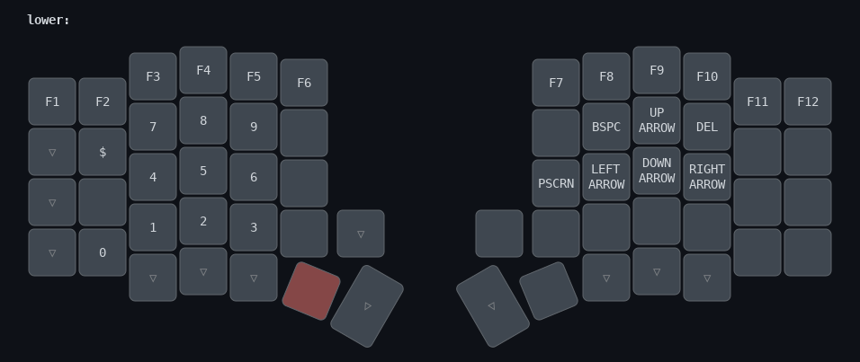

# Custom Sofle keymap

My Sofle keymap customized for Slovenian language, currently using QWERTZ layout.

- Tap-dance for shift and capslock
- [multiple mod-morph behaviors](behaviors_mod_morph.dtsi) to account for Slovene language
- macros for character pairs such as parens, quotes, brackets and braces

### Base Layer:

### Lower Layer:

### Raise Layer:

### Adjust Layer:

