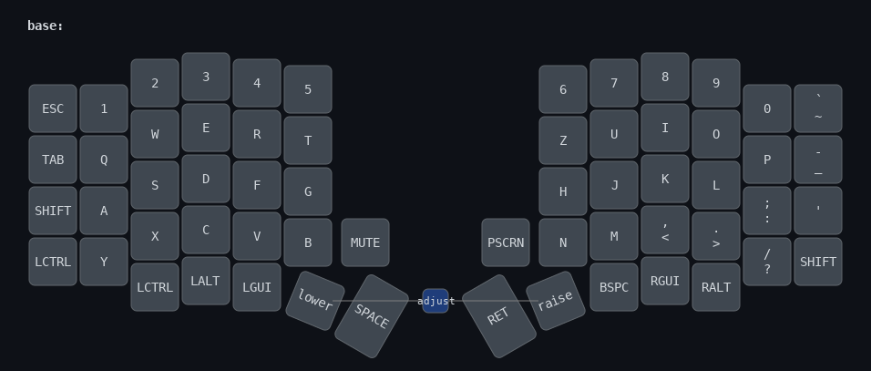
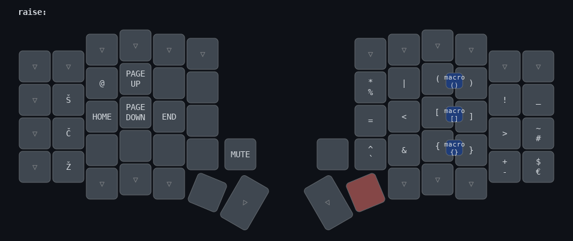
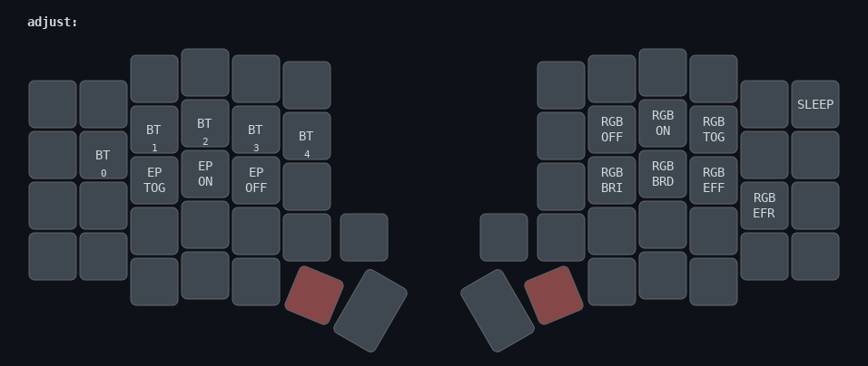

# Custom Sofle keymap

My configuration for the [Aurora Sofle v2](https://splitkb.com/products/aurora-sofle-v2), customized for the Slovenian language (currently using QWERTZ layout).

## Components

- nine!nano v2
- nice!view
- Twilight linear Choc hotswap switches
- rotary encoders on both sides

## Configuration

- Tap-dance for shift and capslock
- [multiple mod-morph behaviors](config/behaviors_mod_morph.dtsi) to support the Slovene language
- macros for character pairs such as parenthesis, quotes, brackets and braces

## Layers

### Base Layer:

### Lower Layer:

### Raise Layer:

### Adjust Layer:

